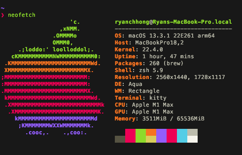

# dotfiles
This repository contains my various configuration files for both Mac OS and ~~Linux (Ubuntu and Arch)~~ (Linux compatability removed for now due to lack of testing).

**Use installation scripts at own risk.**

## Links

<!-- [Ubuntu](./scripts/ubuntu/README.md)  

[Arch Linux (Manjaro)](./scripts/arch/README.md)
 -->
[OSX](./osx/README.md)  

