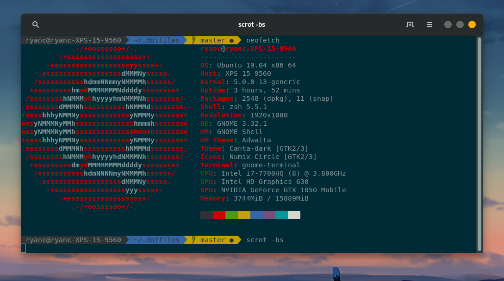

# dotfiles
This repository contains my various configuration files

## Prerequesites
In addition, it is recommended to install vanilla GNOME to remove the Ubuntu branding 

```
sudo apt install gnome-session
# Fix greeter, pick option /usr/share/gnome-shell/theme/gnome-shell.css
sudo update-alternatives --config gdm3.css
```

Select lightdm as the greeter.

## Install
Run the following command in normal mode
```
bash -c "$(wget https://raw.githubusercontent.com/infernalhydra/dotfiles/master/install.sh -O -)"
```

## neofetch screenshot


## Theme
Canta theme with numix circle icons will be installed

## Apps
The Following terminal apps are installed
* curl
* ffmpeg
* scrot
* i3lock
* imagemagick
* gnome-tweak-tool
* chrome-gnome-shell
* neofetch
* vim
* neovim
* Onedrive CLI
* refind
* youtube-dl
* htop
* betterdiscord-cli
* spicetify-cli

The following GUI Apps are installed
* Spotify
* Discord
* VS Code
* VLC Media Player
* Google Chrome
* Gnome Tweaks
* Android Studio
* Postman
* Teamviewer

## Programming
The following are installed
* OpenJDK 8 (Java 8)
* TexLive Full Edition
* pip3
* npm
* React CLI
* React Native CLI
* pandas
* Jupyter Lab
* nodemon
* express
* async
* pug
* handlebars
* sass
* mup
* electron
* The Silver Surfer (ag)
