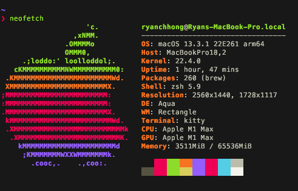

# Mac OS



## Prerequesites

Run the following two commands before running the install script.
```
sudo softwareupdate -i -a
xcode-select --install
```
Among other things, XCode developer tools installs git, which is necessary for the installation script to work

## Install
Run the following command
```
bash -c "$(curl -s https://raw.githubusercontent.com/infernalhydra/dotfiles/main/osx/install.sh)"
```

## Adding SSH keys to keychain
Prior to running this, ensure that there is an SSH that is either generated or migrated from your previous system.  This makes is so you don't have to always type in your ssh key.
```
ssh-add --apple-use-keychain ~/.ssh/id_rsa
```