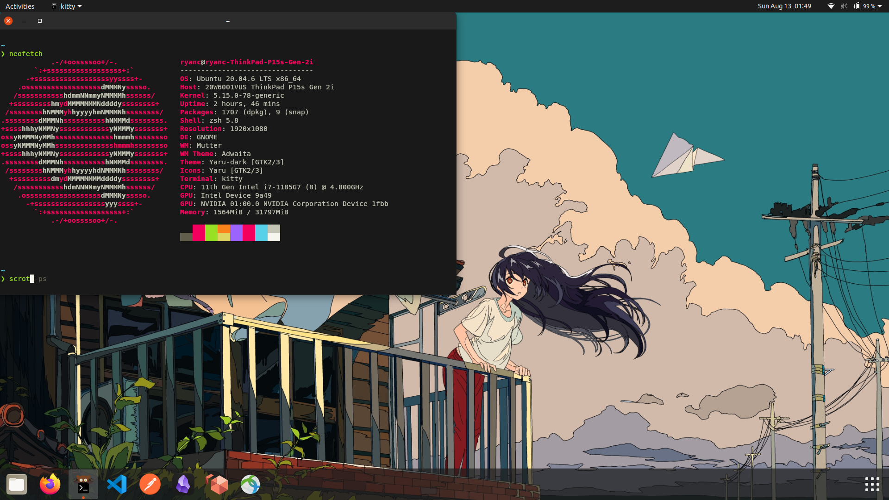

# Ubuntu Linux



## Prerequesites
It is recommended to install vanilla GNOME to remove the Ubuntu branding 

```
sudo apt install gnome-session
# Fix greeter, pick option /usr/share/gnome-shell/theme/gnome-shell.css
sudo update-alternatives --config gdm3.css
```

Select lightdm as the greeter.

## Install
Run the following command
```
bash -c "$(curl -s https://raw.githubusercontent.com/infernalhydra/dotfiles/master/install.sh)"
```

## App
### VS Code Issues
To fix the issues with the terminal, change the font to `MesloLGS Nerd Font Mono`